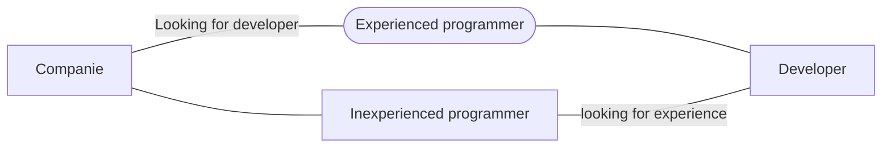

# Project M

This is a simple idea just to pratice concepts like MVVM, Lifecycle, LiveData and Design Patterns

## API
I've used **Picsum** **API** to get the data and description about photographs;
Link to the website-> [Picsum](https://picsum.photos/).

## Technologies i've used

 - **MVVM** - Architecture choosed;
 - **Retrofit** - To get API requests;
 - **Glide** - Library that made possible for me to use images on my app;
 - **RecyclerView** - To list my data on UI;
 - **ViewBinding** - To get access to my View elements with less polution ( to not use FindViewById );
 - **LifeCycle** - Android lifecycle to avoid errors/crashs;
 - **LiveData** - With MVVM, LifeCycle and LiveData i can set Observables that can respect the lifecycle app components like activies, services or even fragments.

# APP Screenshot/Videos

  

## Diagram about companies

> Situation of companies today.

